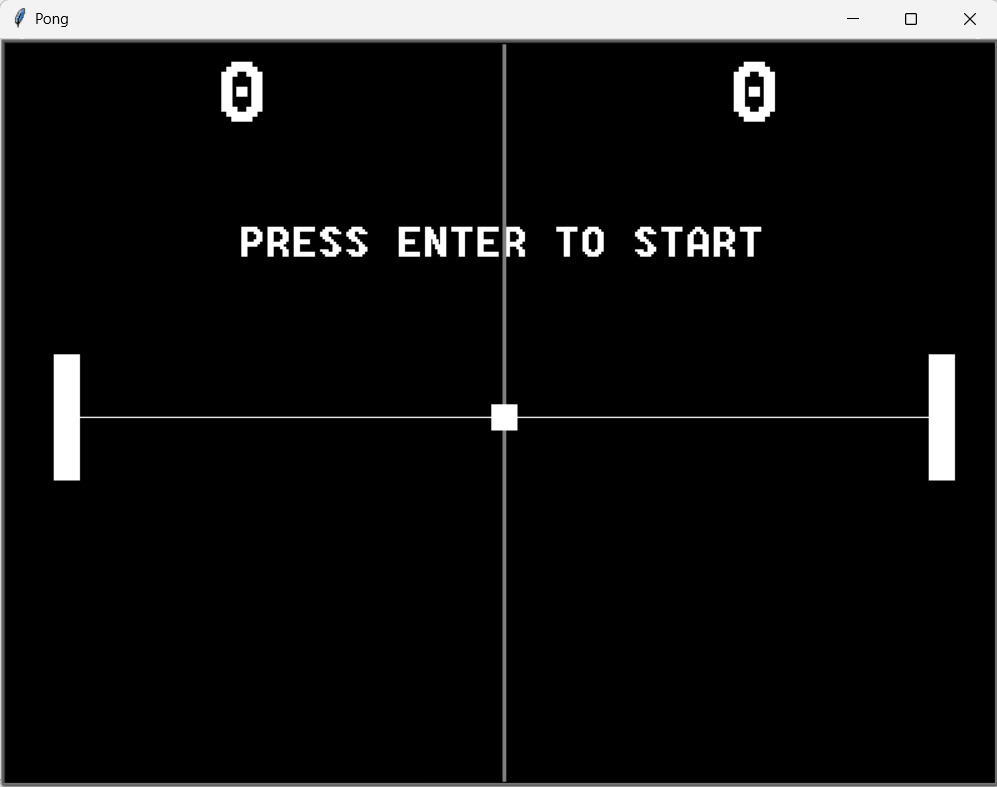

# Juego Pong en Python ES 

En este proyecto se reproduce el clásico juego de arcade Pong. Para ello se ha utilizado el módulo "turtle" para
crear los componentes del juego y detectar las colisiones de la pelota con las paletas de los
jugadores.También puedes definir una serie de asignaciones de teclas para establecer los
controles del usuario para las paletas de los jugadores izquierda y derecha.

# Classic Pong Game in Python EN 
This project recreates the classic arcade game Pong. The game is built using the Turtle module to create the game components and detect collisions between the ball and the players' paddles. Additionally, you can define custom key bindings to set up controls for the left and right paddles.

