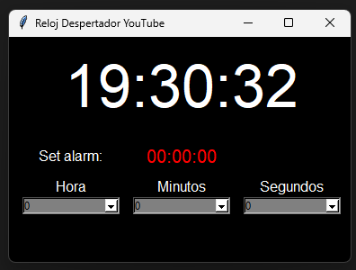

## 📜 README en Español

# 🕰️ Reloj Despertador con YouTube
Este proyecto es una aplicación de reloj despertador creada con Python. Permite al usuario configurar una alarma y, cuando llega la hora, se reproduce un video aleatorio de YouTube desde una lista predefinida.

Se ha utilizado Tkinter para la interfaz gráfica y el módulo webbrowser para abrir los enlaces en el navegador.

## 📌 Características
✅ Interfaz gráfica sencilla con Tkinter
✅ Configuración de la alarma con selección de hora, minutos y segundos
✅ Alarma que reproduce un video de YouTube elegido al azar
✅ Manejo de errores si el archivo de enlaces no existe

## 📦 Requisitos
Python 3.x
Módulos: tkinter, webbrowser, random

## 🔧 Instalación
Clona este repositorio o descarga el código fuente.
Asegúrate de tener Python 3.x instalado en tu sistema.
Prepara un archivo llamado 8_enlaces.txt en el mismo directorio, con una lista de URLs de YouTube (una por línea).

## 🚀 Uso
Configura la hora de la alarma usando los menús desplegables.
Espera a que llegue la hora configurada, y se abrirá un video aleatorio de YouTube.

## 🤖 Tecnologías Utilizadas
Python 🐍
Tkinter 🎨 (Interfaz gráfica)
Webbrowser 🌍 (Apertura de enlaces)
Random 🎲 (Selección aleatoria de enlaces)

## 📜 Licencia
Este proyecto es de código abierto y está disponible bajo la licencia MIT.

## 📜 README in English

# 🕰️ YouTube Alarm Clock
This project is a Python alarm clock application. It allows users to set an alarm, and when the time arrives, it plays a random YouTube video from a predefined list.

The interface is built using Tkinter, and the webbrowser module is used to open the links in a web browser.

## 📌 Features
✅ Simple Tkinter graphical interface
✅ Set alarm time with hours, minutes, and seconds
✅ Alarm plays a random YouTube video
✅ Error handling if the link file is missing

## 📦 Requirements
Python 3.x
Modules: tkinter, webbrowser, random

## 🔧 Installation
Clone this repository or download the source code.
Make sure Python 3.x is installed on your system.
Create a file named 8_enlaces.txt in the same directory, containing a list of YouTube URLs (one per line).

## 🚀 How to Use
Set the alarm time using the dropdown menus.
When the set time arrives, a random YouTube video will open.

## 🤖 Technologies Used
Python 🐍
Tkinter 🎨 (Graphical interface)
Webbrowser 🌍 (Opening URLs)
Random 🎲 (Selecting random links)

## 📜 License
This project is open-source and available under the MIT License.