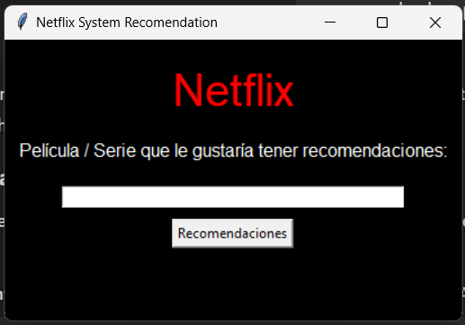

## 📜 README en Español

## 🎬 Sistema de Recomendación de Netflix

## 📌 Descripción
Este es un sistema de recomendación de contenido basado en Netflix. Utiliza algoritmos de filtrado colaborativo y basado en contenido para sugerir películas y series según las preferencias del usuario.

## 🚀 Tecnologías Utilizadas
- pandas: Para el manejo y procesamiento de datos.
- tkinter: Para la interfaz de usuario.
- re: Para manipulación de expresiones regulares.
- unidecode: Para normalización de texto.
- Ingresa tus preferencias o califica películas
- Recibe recomendaciones personalizadas

## 🛠 Uso
Ingresa tus preferencias o califica películas
Recibe recomendaciones personalizadas

## 🤝 Contribución
Si deseas contribuir, por favor crea un pull request o abre un issue.

## 📜 Licencia
Este proyecto es de código abierto y está disponible bajo la licencia MIT.

## 📜 README in English

# 🎬 Netflix Recommendation System

## 📌 Features
This is a Netflix content recommendation system developed in Python. It uses pandas for data manipulation, tkinter for the graphical user interface, and re along with unidecode for text processing.

## 🤖 Technologies Used
- pandas: For data handling and processing.
- tkinter: For the user interface.
- re: For regular expression manipulation.
- unidecode: For text normalization.

## 🚀 How to Use
Enter your preferences or rate movies
Receive personalized recommendations

## 🤝 Contribución
If you want to contribute, feel free to fork the repository and submit a pull request with your improvements.

## 📜 License
This project is open-source and available under the MIT License.